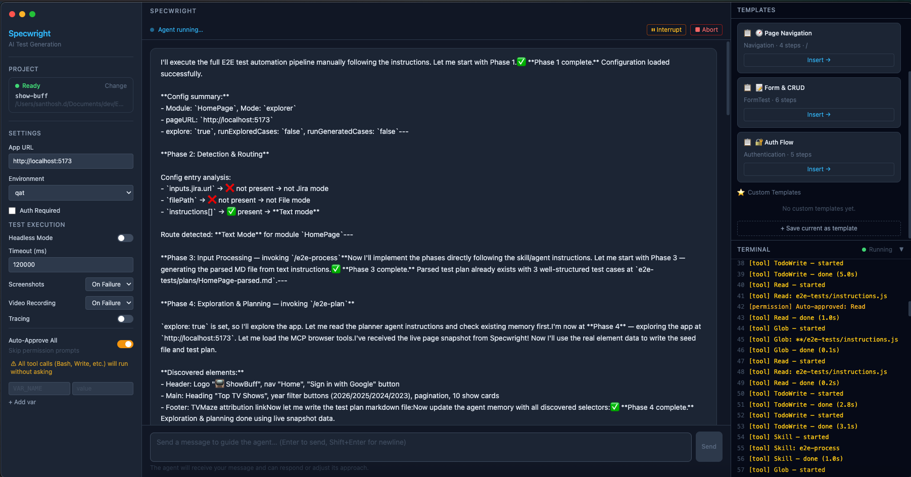
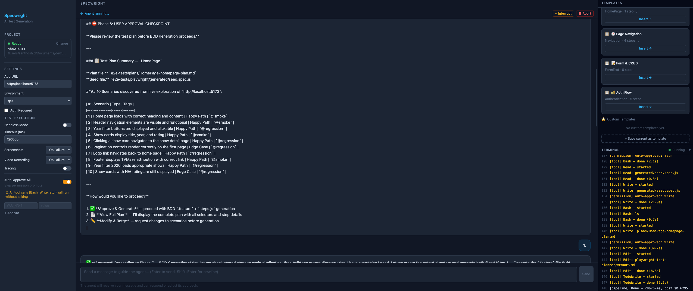

<p align="center">
  <h1 align="center">Specwright</h1>
  <p align="center">
    AI-powered E2E test automation. Point at your app, explore with real browsers, generate Playwright BDD tests.
  </p>
  <p align="center">
    <strong>No SaaS. No vendor lock-in. Runs locally. Open source.</strong>
  </p>
</p>

<p align="center">
  <a href="https://www.npmjs.com/package/@specwright/plugin"></a>
  <a href="https://www.npmjs.com/package/@specwright/mcp-server"></a>
  <a href="https://github.com/SanthoshDhandapani/specwright/blob/main/LICENSE"></a>
</p>

<p align="center">
  <a href="#quick-start">Quick Start</a> &bull;
  <a href="#three-ways-to-use-specwright">Usage</a> &bull;
  <a href="#the-10-phase-pipeline">Pipeline</a> &bull;
  <a href="#showbuff-demo">Demo</a> &bull;
  <a href="#architecture">Architecture</a> &bull;
  <a href="#contributing">Contributing</a>
</p>

---

## What is Specwright?

Specwright turns **"here's my app URL"** into **"here are your E2E tests"** using AI.

It explores your web app in a real browser, discovers UI elements and selectors, then generates production-grade [Playwright BDD](https://github.com/nicolo-ribaudo/playwright-bdd) tests (Gherkin `.feature` files + step definitions) — with self-healing when tests fail.

**100% local.** Specwright runs entirely on your machine using your own Claude session. No data leaves your environment — no remote servers, no telemetry, no code capture. Your source code, credentials, and test data stay on your local filesystem.

<p align="center">
  
  <br>
  <em>Specwright Desktop: AI agent exploring your app, discovering selectors, and generating tests</em>
</p>

---

## Quick Start

### Install the plugin (30 seconds)

```bash
npx @specwright/plugin init
pnpm install && npx playwright install
```

This installs the full E2E framework: 8 AI agents, 8 skills, shared step definitions, Playwright BDD config, and auto-configures the MCP server.

### Generate your first tests

```bash
# With Claude Code CLI:
claude
> /e2e-automate
```

Or use the Desktop App for a visual interface.

---

## Three Ways to Use Specwright

### 1. Plugin + Claude Code CLI

Best for developers who live in the terminal.

```bash
npx @specwright/plugin init              # Install into your project
claude                                    # Open Claude Code
> /e2e-automate                          # Full 10-phase pipeline
> /e2e-plan http://localhost:5173/home   # Explore a single page
> /e2e-generate plan.md                  # Generate BDD from plan
> /e2e-heal                              # Auto-fix failing tests
> /e2e-desktop-automate                  # MCP-powered exploration
```

**Published on npm:**
```bash
npm install -g @specwright/plugin    # or use npx
```

### 2. Desktop App (Electron)

Best for QA engineers and teams who prefer visual tools.

- **Left Panel** — Project picker, App URL, environment, credentials, test execution settings
- **Center Panel** — Visual instructions editor + streaming agent chat output
- **Right Panel** — Quick-start templates + collapsible terminal with color-coded logs
- **Auto-Approve All** — Skip permission prompts for unattended runs
- **Interrupt & Abort** — Pause or stop Claude mid-execution

The desktop app uses code-driven browser exploration — Specwright's `PlaywrightMcpClient` navigates and captures page snapshots automatically when Phase 4 starts, then injects the real accessibility data into Claude's conversation.

```bash
git clone https://github.com/SanthoshDhandapani/specwright.git
cd specwright && pnpm install
cd apps/desktop && npx electron-vite dev
```

### 3. MCP Server + Claude Desktop

Best for Claude Desktop users who want MCP tool access.

**Install:** `npx @specwright/mcp-server` (published on npm as `@specwright/mcp-server`)

**Add to Claude Desktop** (`claude_desktop_config.json`):

```json
{
  "mcpServers": {
    "e2e-automation": {
      "command": "npx",
      "args": ["@specwright/mcp-server"],
      "env": { "PROJECT_ROOT": "/path/to/your/project" }
    },
    "microsoft-playwright": {
      "command": "npx",
      "args": ["@playwright/mcp@latest"]
    }
  }
}
```

**Or with Claude Code** — the plugin auto-creates `.mcp.json`:

```json
{
  "mcpServers": {
    "e2e-automation": {
      "command": "npx",
      "args": ["@specwright/mcp-server"]
    }
  }
}
```

**5 MCP Tools available:**

| Tool | Purpose |
|------|---------|
| `e2e_configure` | Init setup, read/add entries in `instructions.js` |
| `e2e_explore` | Get exploration plan with auth status, known selectors |
| `e2e_plan` | Generate `seed.spec.js` + test plan markdown |
| `e2e_status` | Check pipeline state — config, seed, plans, test results |
| `e2e_automate` | Read `instructions.js` and return full pipeline plan |

Use with the `/e2e-desktop-automate` skill for a guided 5-phase workflow combining the MCP server with Playwright browser exploration.

---

## The 10-Phase Pipeline

```
Phase 1:  Read Config           instructions.js or desktop UI
Phase 2:  Detect & Route        Jira / File / Text input
Phase 3:  Process Input         Convert to parsed test plan
Phase 4:  Explore App           Live browser exploration + selector discovery
Phase 5:  Validate Seeds        Run discovered selectors (optional)
Phase 6:  User Approval         Review plan before generation
Phase 7:  Generate BDD          Create .feature + steps.js files
Phase 8:  Execute & Heal        Run tests + auto-fix failures (optional)
Phase 9:  Cleanup               Aggregate results
Phase 10: Quality Review        Adaptive scoring + summary
```

<p align="center">
  
  <br>
  <em>Phase 6: Review the test plan — 12 scenarios discovered, approve before BDD generation</em>
</p>

### What Gets Generated

```
e2e-tests/features/playwright-bdd/
├── @Modules/
│   ├── @HomePage/           homepage.feature + steps.js
│   ├── @ShowDetail/         show_detail.feature + steps.js
│   └── @Authentication/     authentication.feature + steps.js
└── @Workflows/
    ├── @UserJourney/        Precondition -> Favorites -> Watchlist -> Verify
    └── @ListWorkflow/       Create lists -> Add shows -> Rename -> Delete
```

### Key Framework Features

- **Playwright BDD** — Gherkin `.feature` files compiled to Playwright specs
- **8 AI Agents** — Explore apps, generate tests, fix failures, process Jira tickets
- **8 Claude Code Skills** — `/e2e-automate`, `/e2e-desktop-automate`, `/e2e-plan`, `/e2e-generate`, `/e2e-heal`, `/e2e-validate`, `/e2e-process`, `/e2e-run`
- **5 MCP Tools** — Configure, explore, plan, status, automate via `@specwright/mcp-server`
- **3-Layer Data Persistence** — Scenario > in-memory cache > file-backed JSON
- **Precondition/Consumer Pattern** — Cross-module workflows with shared test data
- **processDataTable** — Declarative form filling with faker data generation
- **Path-Based Tag Scoping** — Directory structure = step visibility rules
- **Adaptive Quality Scoring** — Skipped phases don't penalize the score

---

## ShowBuff Demo

**ShowBuff** (`apps/examples/show-buff/`) is a TV show discovery app built as the primary demo target:

- Browse top TV shows by year (TVMaze API — free, no key needed)
- Show detail pages with cast, images, synopsis
- Google Sign-In (OAuth, mock fallback without client ID)
- Custom Watchlists — full CRUD (Create, Rename, Delete lists, Add/Remove shows)
- Favorites and Watchlist (protected routes)
- All interactive elements have `data-testid` for reliable E2E testing

### Run it:

```bash
cd apps/examples/show-buff
pnpm install && pnpm dev
# Open http://localhost:5173
```

### Demo the pipeline:

```bash
# Option A: Desktop app
cd apps/desktop && npx electron-vite dev
# Select show-buff folder -> Insert "Quick Explore" template -> Save & Execute

# Option B: Claude Code CLI
cd apps/examples/show-buff
claude
> /e2e-automate
```

---

## Architecture

```
specwright/
├── apps/
│   ├── desktop/                 Electron desktop app
│   │   ├── src/main/            Main process (Agent SDK, IPC, PlaywrightMcpClient)
│   │   ├── src/preload/         Context bridge
│   │   └── src/renderer/        React UI (Config, Chat, Templates, Terminal)
│   └── examples/
│       └── show-buff/           ShowBuff demo app (TVMaze + Google OAuth)
│
├── packages/
│   ├── agent-runner/            Claude Agent SDK wrapper + PlaywrightMcpClient
│   ├── plugin/                  E2E framework plugin (npm: @specwright/plugin)
│   └── mcp-server/              MCP server (npm: @specwright/mcp-server)
│
├── IMPLEMENTATION-PLAN.md       Detailed roadmap
├── LICENSE                      MIT
└── README.md
```

**Tech Stack:** Electron 33, React 18, Zustand, Tailwind CSS, `@anthropic-ai/claude-agent-sdk`, `@modelcontextprotocol/sdk`, `playwright-bdd`, `@playwright/mcp`

---

## Configuration

### Authentication (optional)

The plugin includes an auth module with login/logout tests. Skip with `--skip-auth`:

```bash
npx @specwright/plugin init --skip-auth
```

If included, update `e2e-tests/data/authenticationData.js` to match your login form:

```javascript
locators: {
  emailInput: { testId: 'your-email-input' },
  emailSubmitButton: { testId: 'your-submit-button' },
  passwordInput: { testId: 'your-password-input' },
  loginSubmitButton: { testId: 'your-login-button' },
}
```

### Routes

Update `e2e-tests/data/testConfig.js`:

```javascript
routes: {
  Home: '/',
  Dashboard: '/dashboard',
  SignIn: '/signin',
}
```

### Environment

```bash
# e2e-tests/.env.testing
BASE_URL=http://localhost:5173
TEST_USER_EMAIL=your-email@example.com
TEST_USER_PASSWORD=your-password
HEADLESS=false
```

---

## Prerequisites

- **Node.js** 20+
- **pnpm** 9+
- **Claude Code CLI** — [Get it here](https://claude.ai/code)
- **Playwright browsers** — `npx playwright install`

---

## Contributing

Contributions are welcome! See the [Implementation Plan](IMPLEMENTATION-PLAN.md) for the current roadmap.

### Development Setup

```bash
git clone https://github.com/SanthoshDhandapani/specwright.git
cd specwright
pnpm install

# Run the desktop app
cd apps/desktop && npx electron-vite dev

# Run ShowBuff demo
cd apps/examples/show-buff && pnpm dev

# Build packages
cd packages/agent-runner && pnpm build
cd packages/mcp-server   # no build step (plain JS)
```

---

## License

MIT

---

<p align="center">
  Built with <a href="https://claude.ai/code">Claude Code</a> + <a href="https://playwright.dev">Playwright</a> + <a href="https://www.electronjs.org">Electron</a>
</p>
